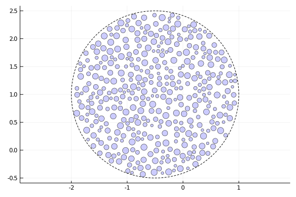
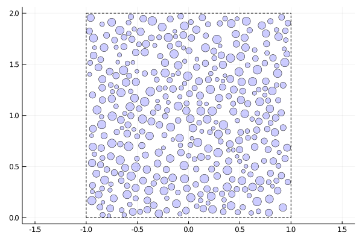
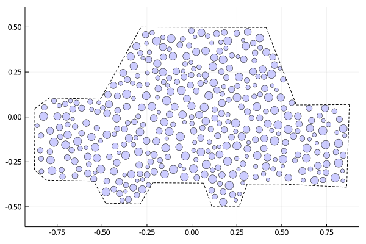

## Installation

CircGeometry.jl is an unregistered julia package.  To install CircGeometry.jl using the REPL, type

`pkg> add https://github.com/pseastham/CircGeometry.jl`

To enter the Pkg environment from the REPL, type `]`.

## Use

CircGeometry.jl takes in some basic information related to the object your are trying to approximate with "filling circles", and exports a file in the custom `circ` format. 

Geometrie are defined by their type (circle, rectangle, or arbitrary polygon), volume fraction, and number of filling circles. The time it takes to generate a circ file will depend on these parameters, but will generally only be a couple minutes for production-level files (e.g. volume fraction of 0.4 with 800 circles).

## Examples

Here are some visualizations of the circ files with accompanying "outline" (dash). Check out the [examples folder](https://github.com/pseastham/CircGeometry.jl/tree/master/examples) to see code for each outline.

<table><tr>
<td></td>
<td></td>
<td></td>
</tr></table>

